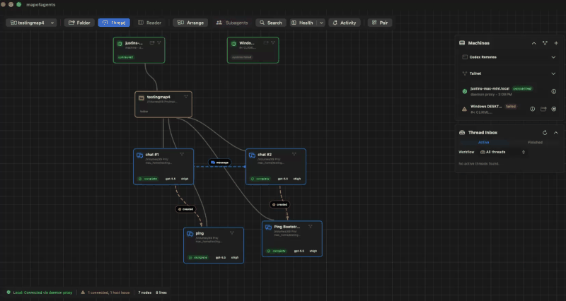
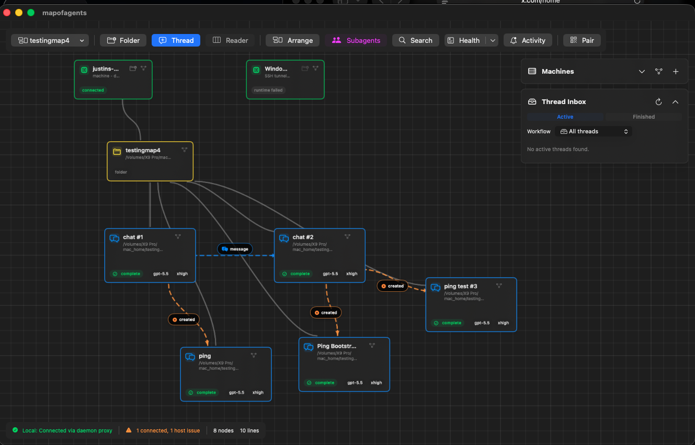

# MapofAgents

MapofAgents is a native SwiftUI control room for Codex App Server. It shows
machines, folders, and Codex threads on a canvas so you can create threads, read
thread history, send messages, and sketch workflow relationships between them.

Codex App Server remains the runtime boundary. It owns authentication, model
configuration, approvals, tools, command execution, and thread history.
MapofAgents stores visual control-room metadata such as node positions, manual
connections, and non-secret endpoint descriptors.

Codex can be extremely powerful with its ability to use the codex app server. It can create chats and communicate with other Codex threads, yet for me it is difficult to follow along with Codex. This app is to make it easier to digest. Like here it is in MapofAgents when you ask it to create new threads:



Here, I made it easier to communicate between threads with just '@' so you can see in real time.


The other solution this app aims to fix is simplying workflows across machines and folders. It's easy to get automated experiments set up across multiple machines/folders, but it is nearly impossible to follow along with the current tools. With the map canvas, I feel like it is easier to digest who is doing what and where.



## Status

This repository is an early MVP. The macOS app is the primary surface. The iOS
target is present as a remote-control companion that connects to authenticated
Codex App Server endpoints; it does not run Codex locally on the phone.

## Requirements

- macOS 14 or newer for the desktop app.
- Swift 6 toolchain, usually from Xcode 16 or newer.
- The Codex CLI with `codex app-server` available on `PATH` for runtime use.
- Full Xcode for iOS builds.
- XcodeGen only when regenerating `mapofagents.xcodeproj` from `project.yml`.

## Quick Start

```sh
git clone https://github.com/jand-2/MapofAgents.git
cd MapofAgents
swift build
swift test
./script/build_and_run.sh
```

Useful development checks:

```sh
swift build
swift test
./script/runtime_diagnostic.py
./script/build_and_run.sh --verify
```

The integration test that connects to a real local Codex App Server is opt-in:

```sh
MAPOFAGENTS_CODEX_INTEGRATION=1 swift test --filter codexAppServerClientConnectsWhenIntegrationEnabled
```

## Codex Runtime

The macOS runtime adapter tries these transports in order:

1. `codex app-server daemon start`
2. `codex app-server proxy` with a WebSocket upgrade over the proxied stream
3. `codex app-server --listen stdio://`

Some Codex installations may not support the daemon/proxy path yet. In that
case MapofAgents falls back to the stdio listener.

For Codex desktop run actions, keep local `.codex/` files out of git and use the
sample in `examples/codex-environment.toml` as a starting point.

## iOS Companion

The iOS project is generated from `project.yml`:

```sh
script/ios_doctor.sh
script/ios_project.sh
script/build_ios.sh sim
MAPOFAGENTS_DEVELOPMENT_TEAM=ABCDE12345 script/build_ios.sh device
MAPOFAGENTS_DEVELOPMENT_TEAM=ABCDE12345 script/build_ios.sh install
```

Physical-device builds require full Xcode, signing configured in Xcode, and a
trusted unlocked iPhone. Use `MAPOFAGENTS_DEVICE_ID=<device-id>` only when more
than one iPhone is connected.

The iOS app expects authenticated Codex App Server or supervisor endpoints.
Remote endpoints should use `wss://` with a bearer token. Loopback `ws://`
endpoints are intended for local tunnels.

For local development on the Mac, this script starts an authenticated loopback
App Server and writes its token under the user's Application Support directory:

```sh
script/start_mac_lan_app_server.sh
```

## Privacy And Safety

The repository should not contain Codex account state, API keys, SSH identities,
machine-specific Codex home files, generated thread artifacts, screenshots, or
videos. Runtime secrets are created locally and ignored by git.

Before publishing changes, run a sensitive-string scan similar to:

```sh
rg -n --hidden --glob '!.git/**' --glob '!.build/**' --glob '!.codex/**' \
  '(/Users/|/Volumes/|OPENAI_API_KEY|secret|token|password|BEGIN .*PRIVATE KEY)'
```

Review each hit. Test fixtures may intentionally use fake paths such as
`/Users/example` and placeholder tokens such as `secret`.

## License And Acknowledgments

MapofAgents is licensed under the Apache License, Version 2.0. See `LICENSE`.

MapofAgents is built to interoperate with the Codex App Server from
[OpenAI Codex](https://github.com/openai/codex). It is a separate project and is
not an official OpenAI product. See `NOTICE` for attribution.
