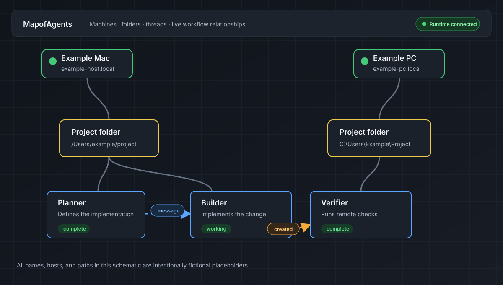

# MapofAgents

MapofAgents is a native SwiftUI control room for Codex App Server. It shows
machines, folders, and Codex threads on a canvas so you can create threads, read
thread history, send messages, and sketch workflow relationships between them.

Codex App Server remains the runtime boundary. It owns authentication, model
configuration, approvals, tools, command execution, and thread history.
MapofAgents stores visual control-room metadata such as node positions, manual
connections, and non-secret endpoint descriptors.

Codex App Server can create threads and let them collaborate, but those
relationships quickly become difficult to follow. MapofAgents makes the
runtime visible: threads can create other threads, exchange `@` messages, and
work across machines and folders while the canvas shows who is doing what and
where.



## Status

This repository is an early MVP. The macOS app is the primary surface. The iOS
target is present as a remote-control companion that connects to authenticated
Codex App Server endpoints; it does not run Codex locally on the phone.

## Requirements

- macOS 14 or newer for the desktop app.
- Swift 6 toolchain, usually from Xcode 16 or newer.
- The Codex CLI with `codex app-server` available on `PATH` for runtime use.
- Full Xcode for iOS builds.
- XcodeGen only when regenerating `mapofagents.xcodeproj` from `project.yml`.
- Tailscale on the Mac and iPhone, signed in to the same tailnet, when using
  secure iPhone pairing. The tailnet must support MagicDNS and HTTPS
  certificates for Tailscale Serve.

## Quick Start

```sh
git clone https://github.com/jand-2/MapofAgents.git
cd MapofAgents
swift build
swift test
./script/build_and_run.sh
```

Useful development checks:

```sh
swift build
swift test
./script/runtime_diagnostic.py
./script/build_and_run.sh --verify
```

GitHub Actions also runs repository and protocol validation, a public-safety
scan, Swift build/test/coverage checks, a generated iOS Simulator build, and a
locked Windows restore/test/Release x64 build. See `.github/workflows/ci.yml`.

The integration test that connects to a real local Codex App Server is opt-in:

```sh
MAPOFAGENTS_CODEX_INTEGRATION=1 swift test --filter codexAppServerClientConnectsWhenIntegrationEnabled
```

## Codex Runtime

The macOS runtime adapter tries these transports in order:

1. `codex app-server daemon start`
2. `codex app-server proxy` with a WebSocket upgrade over the proxied stream
3. `codex app-server --listen stdio://`

Some Codex installations may not support the daemon/proxy path yet. In that
case MapofAgents falls back to the stdio listener.

For Codex desktop run actions, keep local `.codex/` files out of git and use the
sample in `examples/codex-environment.toml` as a starting point.

## iOS Companion

The iOS project is generated from `project.yml`:

```sh
script/ios_doctor.sh
script/ios_project.sh
script/build_ios.sh sim
MAPOFAGENTS_DEVELOPMENT_TEAM=ABCDE12345 script/build_ios.sh device
MAPOFAGENTS_DEVELOPMENT_TEAM=ABCDE12345 script/build_ios.sh install
```

Physical-device builds require full Xcode, signing configured in Xcode, and a
trusted unlocked iPhone. Use `MAPOFAGENTS_DEVICE_ID=<device-id>` only when more
than one iPhone is connected.

Tailscale HTTPS certificates are recorded in public Certificate Transparency
logs. Use a non-sensitive Tailscale machine name before enabling HTTPS for a
pairing host.

### Secure iPhone pairing

On the Mac, open **Pair iPhone**, then scan the displayed code with the iOS
companion. The Mac keeps Codex App Server and the credential exchange bound to
loopback and uses Tailscale Serve to expose two private tailnet routes:

- `wss://<mac-name>.<tailnet>.ts.net` for the authenticated App Server relay.
- `https://<mac-name>.<tailnet>.ts.net:8443/v1/pairing` for device enrollment and
  credential refresh.

The QR code contains a one-time enrollment credential that expires after 30
minutes. The iPhone exchanges it for a revocable device refresh credential,
stores that credential in Keychain, and requests short-lived access tokens as
needed. Access tokens last at most five minutes and are never used as the
persistent pairing record. The Mac stores only a hash of the refresh credential
in its paired-device registry. An app-owned loopback gateway validates the
signed access token and current device registry before forwarding a WebSocket
to Codex App Server; the backend port itself is never published to the tailnet.

Closing the pairing popover does not disconnect an enrolled phone. While the
Mac app is running, it supervises the pairing host independently of the
popover. That supervision and its Tailscale Serve configuration start only
when the user opens **Pair iPhone** or the Mac already has an active paired
device; a first launch with no paired devices does not configure pairing
routes.

The gateway closes the server-side socket at token expiry and immediately when
the device is revoked, so enforcement does not depend on a cooperative iPhone
client. It also refuses to start unless the Codex backend belongs to the current
user. Backend ownership probes run away from the gateway's proxy queue, so a
slow system probe cannot delay token expiry or revocation. The enrollment
listener also caps concurrent clients, applies a whole-request deadline, and
drains open requests during replacement or shutdown. The two Serve routes run
as foreground, app-scoped processes behind a small parent-process guardian. A
gateway or current-generation backend failure tears down the routes; a late
callback from a replaced backend cannot tear down its successor. Quitting or
crashing MapofAgents does the same instead of leaving persistent forwards that
a different local process could claim. Upgrades from the earlier background
configuration remove those legacy routes once before starting the guarded ones.

The Mac's **Pair iPhone** popover lists enrolled devices. Revoking a device
closes its active gateway connections immediately and prevents future token
refreshes. The device must scan a new code to enroll again.

For manually configured endpoints, remote connections must still use `wss://`
with an authentication credential. Loopback `ws://` is reserved for local
tunnels; pairing does not weaken that transport policy.

## Windows Preview

A native Windows preview lives under `windows/` as a C#/.NET WinUI 3 app with a
WebView2 graph renderer. It is kept in this repository so the Apple and Windows
clients can share protocol fixtures and App Server behavior. See
`docs/windows-port.md` for build steps and current scope.

Secure device enrollment is not yet available on Windows. The Windows client
shows that state explicitly and does not expose its legacy pairing host or
import panels.

For local development on the Mac, this script starts an authenticated loopback
App Server and writes its token under the user's Application Support directory:

```sh
script/start_mac_lan_app_server.sh
```

## Privacy And Safety

The repository should not contain Codex account state, API keys, SSH identities,
machine-specific Codex home files, generated thread artifacts, screenshots, or
videos. Runtime secrets are created locally and ignored by git.

Before publishing changes, run a sensitive-string scan similar to:

```sh
rg -n --hidden --glob '!.git/**' --glob '!.build/**' --glob '!.codex/**' \
  '(/Users/|/Volumes/|OPENAI_API_KEY|secret|token|password|BEGIN .*PRIVATE KEY)'
```

Review each hit. Test fixtures may intentionally use fake paths such as
`/Users/example` and placeholder tokens such as `secret`.

## License And Acknowledgments

MapofAgents is licensed under the Apache License, Version 2.0. See `LICENSE`.

MapofAgents is built to interoperate with the Codex App Server from
[OpenAI Codex](https://github.com/openai/codex). It is a separate project and is
not an official OpenAI product. See `NOTICE` for attribution.
